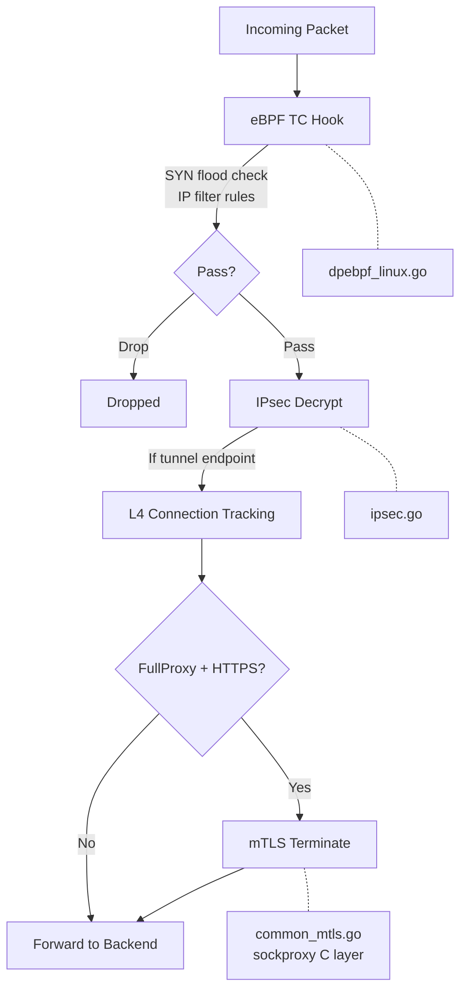

# Secure Dataplane Overview

!!! enterprise "Enterprise Feature"
    This feature requires loxilb-enterprise. It is not available in the community edition.
    See [Installation](../getting-started/installation.md) for enterprise binary setup.

## Understanding the Secure Dataplane

loxilb-enterprise encrypts and protects traffic at three distinct layers — each optimized for different deployment patterns and security requirements. Understanding when to use each layer is critical for designing a security architecture that meets compliance requirements without over-engineering.

The three layers operate at different points in the network stack:

- **IPsec** operates at L3 (Network layer), providing node-to-node tunnel encryption. All traffic between two endpoints is encrypted transparently, regardless of application protocol.
- **mTLS** operates at L7 (Application layer), providing per-service mutual authentication. Both client and server present certificates during the TLS handshake, enabling zero-trust service-to-service security.
- **eBPF Security** operates at L3-L4 (Kernel datapath), providing high-performance packet filtering. SYN flood mitigation and IP-based access control happen in the kernel before packets reach userspace.

## Three-Layer Comparison

| Aspect | IPsec | mTLS | eBPF Security |
|--------|-------|------|---------------|
| OSI Layer | L3 (Network) | L7 (Application) | L3-L4 (Kernel) |
| Protection Scope | Node-to-node tunnel | Per-service mutual auth | Per-packet filtering |
| Authentication | PSK or X.509 certificates | Client/server certificates | IP-based rules |
| Encryption | AES-128/256, 3DES | TLS 1.2+ (OpenSSL) | N/A (filtering, not encryption) |
| Use Case | Site-to-site VPN, DC mesh | HTTPS FullProxy, zero-trust | DDoS mitigation, access control |
| Performance Impact | Moderate (crypto offload available) | Higher (TLS handshake per connection) | Minimal (kernel fast path) |
| loxilb Implementation | strongSwan integration | sockproxy C layer | TC hook programs |
| Source | `ipsec.go` | `common_mtls.go` | `dpebpf_linux.go` |

## When to Use Each Layer

### IPsec — Transparent L3 Encryption

Use IPsec when you need transparent encryption between loxilb nodes or to external gateways. IPsec encrypts all traffic in a tunnel — applications do not need any changes.

**Best for:**

- Multi-site connectivity between data centers
- Regulatory-mandated encryption in transit (PCI-DSS, HIPAA)
- Legacy applications that cannot be modified to use TLS
- Mesh encryption between all cluster nodes

**Key characteristics:** IKEv1/IKEv2 negotiation, automatic SA rekeying, Dead Peer Detection (DPD) for tunnel health monitoring.

### mTLS — Per-Service Mutual Authentication

Use mTLS when you need mutual authentication at the service level with certificate-based identity. Both the client and the server prove their identity during the TLS handshake.

!!! warning "FullProxy mode required"
    mTLS only works with `security=1` (HTTPS) or `security=2` (E2E HTTPS) and `mode=4` (FullProxy). It has **no effect** in DSR or NAT mode. Source: swagger.yml:6360.

**Best for:**

- Zero-trust architectures requiring service identity verification
- API-to-API security with client certificate validation
- Compliance requirements mandating mutual authentication
- Fine-grained access control based on certificate Common Name patterns

**Key characteristics:** Frontend mTLS (validate client certs) and backend mTLS (verify server certs) are configured independently per load balancer rule.

### eBPF Security — Kernel-Level Packet Filtering

Use eBPF security features when you need high-performance packet filtering at the kernel level. Packets are inspected and dropped before reaching userspace, minimizing CPU overhead during DDoS attacks.

**Best for:**

- DDoS protection (SYN flood, UDP flood, connection rate limiting)
- IP-based access control (whitelist/blacklist)
- High-throughput environments where userspace filtering is too expensive
- First line of defense before application-layer security

**Key characteristics:** TC hook programs in the eBPF dataplane, SYN cookie activation under flood conditions, per-rule packet and byte counters for monitoring.

## Layered Security Architecture

The following diagram shows how all three layers combine in the loxilb data path:



Each layer is independently configurable. You can deploy IPsec tunnels without mTLS, or eBPF filtering without IPsec. The layers compose — traffic can pass through all three in sequence for maximum security posture.

## Hardware Acceleration

### IPsec Crypto Offload

IPsec supports hardware acceleration for encryption operations via the `hwOffloadEnabled` configuration flag. When enabled, cryptographic operations are offloaded to supported hardware accelerators (QAT, DPAA2), significantly reducing CPU overhead for high-throughput encrypted tunnels.

```
# Source: ipsec.go — IPsecConfig
hwOffloadEnabled: true    # Enable QAT/DPAA2 crypto offload
antiReplayEnabled: true   # Anti-replay protection (recommended)
mtu: 1400                 # Default MTU for IPsec tunnels
```

**MTU considerations:** IPsec adds overhead to each packet (ESP header, IV, padding, authentication). The default MTU of 1400 bytes accounts for this overhead. Adjust if your network path has a non-standard MTU.

### Anti-Replay Protection

The `antiReplayEnabled` flag enables IPsec anti-replay protection, which detects and drops replayed packets using a sliding window of sequence numbers. This is recommended for all production deployments to prevent replay attacks.

## Deep Dive Pages

For detailed configuration of each security layer:

- **IPsec tunnels:** [IPsec Configuration](ipsec.md) — strongSwan integration, algorithm selection, tunnel CRUD API, certificate management
- **mTLS certificates:** [mTLS Configuration](mtls.md) — frontend/backend certificate config, FullProxy mode setup, CN pattern matching
- **SYN flood and IP filtering:** [SYN Flood Protection](syn-flood.md) and [IP Filtering](ip-filtering.md) — unified SecurityRateConfig API, eBPF-level DDoS mitigation

## See Also

- [Security Gateway Overview](overview.md) — Full Security Gateway feature map with fail-mode and port allocation tables
- [Deployment Scenarios](deployment-scenarios.md) — How to combine security layers for different compliance requirements
- [Configuration Reference](configuration-reference.md) — Quick-reference table for all security configuration fields
