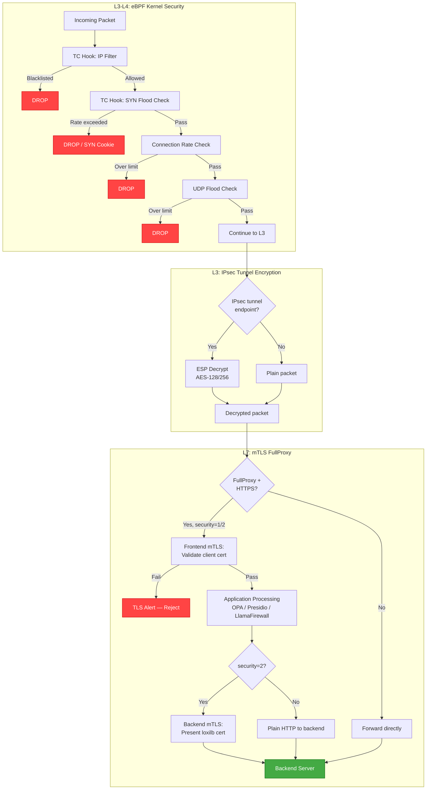
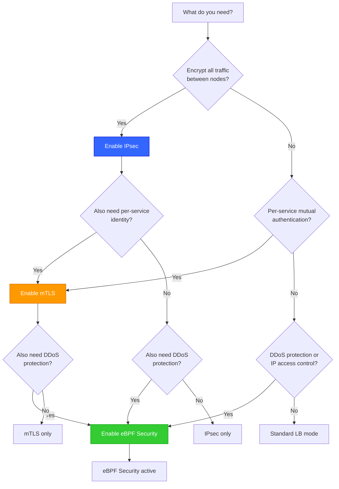

# Secure Dataplane Overview

!!! enterprise "Enterprise Feature"
    This feature requires loxilb-enterprise. It is not available in the community edition.
    See [Installation](../getting-started/installation.md) for enterprise binary setup.

## Understanding the Secure Dataplane

loxilb-enterprise encrypts and protects traffic at three distinct layers — each optimized for different deployment patterns and security requirements. Understanding when to use each layer is critical for designing a security architecture that meets compliance requirements without over-engineering.

The three layers operate at different points in the network stack:

- **IPsec** operates at L3 (Network layer), providing node-to-node tunnel encryption. All traffic between two endpoints is encrypted transparently, regardless of application protocol.
- **mTLS** operates at L7 (Application layer), providing per-service mutual authentication. Both client and server present certificates during the TLS handshake, enabling zero-trust service-to-service security.
- **eBPF Security** operates at L3-L4 (Kernel datapath), providing high-performance packet filtering. SYN flood mitigation and IP-based access control happen in the kernel before packets reach userspace.

## Three-Layer Security Architecture

The following diagram shows all three security layers and how a request flows through them in the loxilb data plane:



!!! info "Layers are independent and composable"
    Each layer can be enabled or disabled independently. You can deploy IPsec without mTLS, eBPF filtering without IPsec, or all three layers for maximum defense in depth. The layers compose — traffic passes through all active layers in sequence.

## Three-Layer Comparison

| Aspect | IPsec | mTLS | eBPF Security |
|--------|-------|------|---------------|
| OSI Layer | L3 (Network) | L7 (Application) | L3-L4 (Kernel) |
| Protection Scope | Node-to-node tunnel | Per-service mutual auth | Per-packet filtering |
| Authentication | PSK or X.509 certificates | Client/server certificates | IP-based rules |
| Encryption | AES-128/256, 3DES | TLS 1.2+ (OpenSSL) | N/A (filtering, not encryption) |
| Use Case | Site-to-site VPN, DC mesh | HTTPS FullProxy, zero-trust | DDoS mitigation, access control |
| Performance Impact | Moderate (crypto offload available) | Higher (TLS handshake per connection) | Minimal (kernel fast path) |
| Configuration | Per-tunnel (global) | Per-LB rule (per-service) | Per-rule (global or per-zone) |

## When to Use Each Layer

### Decision Flowchart



### IPsec — Transparent L3 Encryption

Use IPsec when you need transparent encryption between loxilb nodes or to external gateways. IPsec encrypts all traffic in a tunnel — applications do not need any changes.

**Best for:**

- Multi-site connectivity between data centers
- Regulatory-mandated encryption in transit (PCI-DSS, HIPAA)
- Legacy applications that cannot be modified to use TLS
- Mesh encryption between all cluster nodes

**Key characteristics:** IKEv1/IKEv2 negotiation, automatic SA rekeying, Dead Peer Detection (DPD) for tunnel health monitoring.

### mTLS — Per-Service Mutual Authentication

Use mTLS when you need mutual authentication at the service level with certificate-based identity. Both the client and the server prove their identity during the TLS handshake.

!!! warning "FullProxy mode required"
    mTLS only works with `security=1` (HTTPS) or `security=2` (E2E HTTPS) and `mode=4` (FullProxy). It has **no effect** in DSR or NAT mode.

**Best for:**

- Zero-trust architectures requiring service identity verification
- API-to-API security with client certificate validation
- Compliance requirements mandating mutual authentication
- Fine-grained access control based on certificate Common Name patterns

**Key characteristics:** Frontend mTLS (validate client certs) and backend mTLS (verify server certs) are configured independently per load balancer rule.

### eBPF Security — Kernel-Level Packet Filtering

Use eBPF security features when you need high-performance packet filtering at the kernel level. Packets are inspected and dropped before reaching userspace, minimizing CPU overhead during DDoS attacks.

**Best for:**

- DDoS protection (SYN flood, UDP flood, connection rate limiting)
- IP-based access control (whitelist/blacklist)
- High-throughput environments where userspace filtering is too expensive
- First line of defense before application-layer security

**Key characteristics:** TC hook programs in the eBPF dataplane, SYN cookie activation under flood conditions, per-rule packet and byte counters for monitoring.

### Compliance Mapping

| Requirement | IPsec | mTLS | eBPF Security | Recommended Combination |
|-------------|:-----:|:----:|:-------------:|------------------------|
| PCI-DSS (encryption in transit) | **Required** | Optional | Optional | IPsec + eBPF |
| HIPAA (PHI protection) | **Required** | Recommended | Recommended | IPsec + mTLS + eBPF |
| SOC 2 (access controls) | Optional | Optional | **Required** | mTLS + eBPF |
| Zero Trust (identity verification) | Optional | **Required** | Recommended | mTLS + eBPF |
| DDoS protection | N/A | N/A | **Required** | eBPF minimum |

## Deep Internals

### Processing Order When Multiple Layers Are Active

When all three layers are enabled, the processing order is strictly defined:

1. **eBPF Security (first):** IP filtering and SYN flood protection run in the eBPF TC hook. This is the fastest check — malicious packets are dropped before any crypto processing occurs. This saves CPU cycles that would otherwise be wasted decrypting attack traffic.

2. **IPsec (second):** If the packet arrives via an IPsec tunnel, ESP decryption runs next. Only packets that passed the eBPF filter are decrypted — preventing resource waste on attack traffic within tunnels.

3. **mTLS (third):** For FullProxy HTTPS services, TLS termination and client certificate validation run in userspace via OpenSSL. This is the most CPU-intensive check, applied only to packets that passed both eBPF and IPsec processing.

This ordering is significant: the cheapest checks run first, and the most expensive checks run last. A SYN flood attack never triggers TLS processing or IPsec decryption.

### Performance Stacking

Enabling multiple layers has cumulative performance impact:

| Configuration | Relative Throughput | Latency Overhead |
|---------------|:------------------:|:----------------:|
| No security (baseline) | 100% | — |
| eBPF only | ~99% | < 1 μs |
| IPsec only | ~70-85% | 10-50 μs (crypto) |
| mTLS only | ~60-80% | 1-5 ms (TLS handshake) |
| IPsec + eBPF | ~70-85% | 10-50 μs |
| mTLS + eBPF | ~60-80% | 1-5 ms |
| All three layers | ~55-75% | 1-5 ms + 10-50 μs |

!!! tip "Hardware acceleration"
    IPsec throughput improves significantly with crypto offload (`hw_offload_enabled: true`). With hardware acceleration, IPsec overhead drops to ~5-10%, bringing the "all three layers" configuration close to mTLS-only performance.

### Certificate Management

| Layer | Certificate Type | Scope | Management |
|-------|-----------------|-------|------------|
| IPsec | X.509 or PSK | Per-tunnel | Global: `/config/ipsec/tunnels` |
| mTLS Frontend | Client CA cert | Per-LB rule | Rule-level: `mtls_frontend.client_ca_path` |
| mTLS Backend | loxilb client cert + Backend CA | Per-LB rule | Rule-level: `mtls_backend.client_cert_path` |

IPsec and mTLS certificates are managed independently — there is no shared certificate store. This allows different PKI hierarchies for network-level encryption (IPsec) and application-level authentication (mTLS).

### Failure Isolation

Each security layer fails independently:

| Layer Failure | Impact on Other Layers |
|---------------|----------------------|
| eBPF program error | IPsec and mTLS continue normally. eBPF failure defaults to allow (fail-open). |
| IPsec tunnel down | eBPF filtering continues. mTLS continues for non-tunnel traffic. Tunnel traffic is dropped. |
| mTLS cert expired | eBPF and IPsec continue. Only the specific LB rule with expired certs rejects connections. |
| mTLS CA path invalid | Rule creation fails. Other rules and layers unaffected. |

## Configuration Scenarios

### Scenario A: Full Defense in Depth — All Three Layers

All security layers active for maximum protection. Suitable for high-security environments requiring encryption, mutual authentication, and DDoS protection.

```bash
# 1. Enable eBPF security: IP filtering + SYN flood protection
curl -X POST http://loxilb:11111/netlox/v1/config/ipfilter \
  -H "Authorization: Bearer <token>" \
  -H "Content-Type: application/json" \
  -d '{"filterType": "whitelist", "cidr": "10.0.0.0/8", "zone": 0, "priority": 100, "action": "allow"}'

curl -X POST http://loxilb:11111/netlox/v1/config/securityrate \
  -H "Authorization: Bearer <token>" \
  -H "Content-Type: application/json" \
  -d '{
    "synEnabled": true, "synThreshold": 100, "cookieThreshold": 50,
    "connRateEnabled": true, "ratePerSec": 50, "concurrentLimit": 200,
    "udpEnabled": true, "udpPktThreshold": 1000, "udpBandwidthMB": 100,
    "whitelistIps": ["10.0.0.0/8"]
  }'

# 2. Create IPsec tunnel between sites
curl -X POST http://loxilb:11111/netlox/v1/config/ipsec/tunnels \
  -H "Authorization: Bearer <token>" \
  -H "Content-Type: application/json" \
  -d '{
    "name": "dc1-to-dc2",
    "local_ip": "203.0.113.1",
    "remote_ip": "203.0.113.2",
    "ike_version": 2,
    "encryption": "aes256",
    "integrity": "sha256",
    "dh_group": 14,
    "local_subnet": "10.0.1.0/24",
    "remote_subnet": "10.0.2.0/24"
  }'

# 3. Create HTTPS LB rule with full mTLS
curl -X PUT http://loxilb:11111/netlox/v1/config/loadbalancer/secure-svc \
  -H "Authorization: Bearer <token>" \
  -H "Content-Type: application/json" \
  -d '{
    "name": "secure-svc",
    "host": "api.secure.example.com",
    "port": 443,
    "protocol": "https",
    "mode": 4,
    "security": 2,
    "mtls_frontend": {
      "client_cert_mode": "required",
      "client_ca_path": "/opt/loxilb/cert/client_ca.crt",
      "require_client_cn": true,
      "client_cn_pattern": "*.internal.example.com"
    },
    "mtls_backend": {
      "verify_server_cert": true,
      "backend_ca_path": "/opt/loxilb/cert/backend_ca.crt",
      "client_cert_path": "/opt/loxilb/cert/loxilb.crt",
      "client_key_path": "/opt/loxilb/cert/loxilb.key"
    },
    "endpoints": [{"ep_address": "10.0.2.10", "ep_port": 8443}]
  }'
```

### Scenario B: Cloud-Native Zero Trust — mTLS + eBPF (No IPsec)

Relies on cloud provider network encryption instead of IPsec. Uses mTLS for service identity and eBPF for DDoS protection. Common in Kubernetes and cloud-native environments.

```bash
# 1. Enable eBPF security
curl -X POST http://loxilb:11111/netlox/v1/config/securityrate \
  -H "Authorization: Bearer <token>" \
  -H "Content-Type: application/json" \
  -d '{
    "synEnabled": true, "synThreshold": 200, "cookieThreshold": 100,
    "connRateEnabled": true, "ratePerSec": 100, "concurrentLimit": 500,
    "udpEnabled": false, "udpPktThreshold": 0, "udpBandwidthMB": 0,
    "whitelistIps": ["10.0.0.0/8", "172.16.0.0/12"]
  }'

# 2. Create mTLS-protected service (no IPsec tunnel needed)
curl -X PUT http://loxilb:11111/netlox/v1/config/loadbalancer/cloud-api \
  -H "Authorization: Bearer <token>" \
  -H "Content-Type: application/json" \
  -d '{
    "name": "cloud-api",
    "host": "api.cloud.example.com",
    "port": 443,
    "protocol": "https",
    "mode": 4,
    "security": 1,
    "mtls_frontend": {
      "client_cert_mode": "required",
      "client_ca_path": "/opt/loxilb/cert/cluster_ca.crt"
    },
    "endpoints": [
      {"ep_address": "10.0.1.10", "ep_port": 8080},
      {"ep_address": "10.0.1.11", "ep_port": 8080}
    ]
  }'
```

!!! note "Cloud provider encryption"
    In cloud environments (AWS, GCP, Azure), network traffic between instances within the same VPC is typically encrypted at the infrastructure level. IPsec adds additional overhead without significant security benefit in these environments. Use mTLS for application-level identity and eBPF for DDoS protection.

## REST API Configuration

The secure dataplane combines three protection layers. Each is configured via its own REST API endpoint:

- **IPsec:** `POST /config/ipsec/tunnels` — [IPsec Configuration](ipsec.md)
- **mTLS:** Per-LB rule `mtls_frontend` / `mtls_backend` fields — [mTLS Configuration](mtls.md)
- **SYN Flood Protection:** `POST /config/securityrate` — [SYN Flood Protection](syn-flood.md)
- **IP Filtering:** `POST /config/ipfilter` — [IP Filtering](ip-filtering.md)

## Verify

To verify each layer of the secure dataplane:

- **IPsec:** See [IPsec Verify](ipsec.md#verify)
- **mTLS:** See [mTLS Verify](mtls.md#verify)
- **SYN Flood:** See [SYN Flood Verify](syn-flood.md#verify)
- **IP Filtering:** See [IP Filtering Verify](ip-filtering.md#verify)

## Deep Dive Pages

For detailed configuration of each security layer:

- **IPsec tunnels:** [IPsec Configuration](ipsec.md) — strongSwan integration, algorithm selection, tunnel CRUD API, certificate management
- **mTLS certificates:** [mTLS Configuration](mtls.md) — frontend/backend certificate config, FullProxy mode setup, CN pattern matching
- **SYN flood and rate limiting:** [SYN Flood Protection](syn-flood.md) — unified SecurityRateConfig API, eBPF-level DDoS mitigation
- **IP filtering:** [IP Filtering](ip-filtering.md) — whitelist/blacklist rules, zone-based segmentation, LPM trie implementation

## See Also

- [IPsec API Reference](../reference/api.md#ipsec)
- [Security Controls API Reference](../reference/api.md#security-controls)
- [Security Gateway Overview](overview.md) — Full Security Gateway feature map with fail-mode and port allocation tables
- [Deployment Scenarios](deployment-scenarios.md) — How to combine security layers for different compliance requirements
- [Configuration Reference](configuration-reference.md) — Quick-reference table for all security configuration fields
