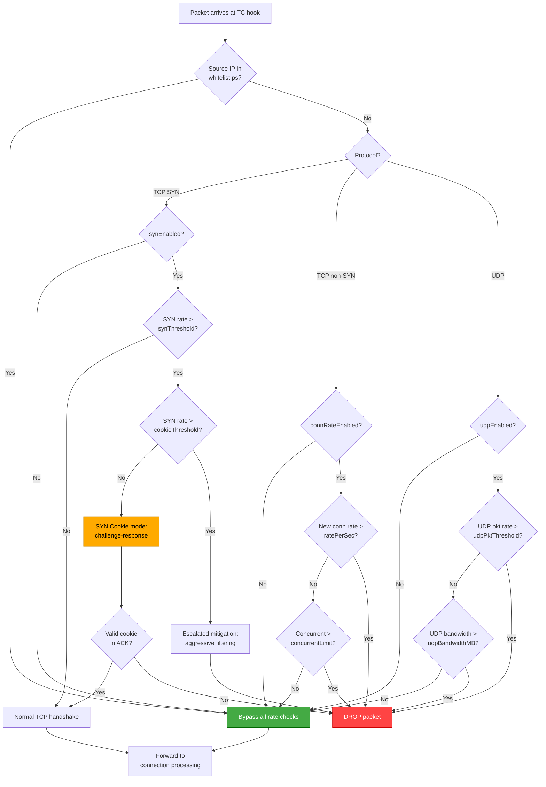

# SYN Flood Protection

!!! enterprise "Enterprise Feature"
    This feature requires loxilb-enterprise. It is not available in the community edition.
    See [Installation](../getting-started/installation.md) for enterprise binary setup.

## What is SYN Flood Protection?

SYN flood attacks exhaust server connection tables by sending a flood of TCP SYN packets without completing the three-way handshake. Each half-open connection consumes memory and a slot in the connection table — at sufficient volume, legitimate connections are denied.

loxilb mitigates SYN floods at the **eBPF dataplane level**. Packets are filtered in the kernel TC (Traffic Control) hook before reaching userspace, minimizing CPU overhead during attacks. When the SYN rate exceeds the configured threshold, loxilb activates SYN cookie mode to validate connections without consuming connection table resources.

## SYN Flood Mitigation Pipeline

The following diagram shows how SYN flood protection, connection rate limiting, and UDP flood protection work together in the eBPF TC hook:



## Unified Security Rate Control

loxilb provides a **unified SecurityRateConfig API** that manages three related protections through a single endpoint:

| Protection | Prefix | What it Controls |
|-----------|--------|-----------------|
| **SYN Flood** (P0-5) | `syn*` | TCP SYN packet rate, SYN cookie activation |
| **Connection Rate** (P0-6) | `connRate*`, `rate*`, `concurrent*` | New connection rate, max concurrent connections |
| **UDP Flood** (P0-7) | `udp*` | UDP packet rate, bandwidth limit |

All three protections share a `whitelistIps` array — trusted CIDRs that are exempt from all rate controls.

## REST API Configuration

### Unified SecurityRateConfig (Recommended)

```bash
curl -X POST http://loxilb:11111/netlox/v1/config/securityrate \
  -H "Authorization: Bearer <token>" \
  -H "Content-Type: application/json" \
  -d '{
    "synEnabled": true,
    "synThreshold": 100,
    "cookieThreshold": 50,
    "connRateEnabled": true,
    "ratePerSec": 50,
    "concurrentLimit": 200,
    "udpEnabled": false,
    "udpPktThreshold": 1000,
    "udpBandwidthMB": 100,
    "whitelistIps": ["10.0.0.0/8", "172.16.0.0/12"]
  }'

# Response (204): No Content — configuration applied successfully
```

### Field Reference

**SYN Flood Protection (P0-5):**

| Field | Type | Valid Values | Default | Description |
|-------|------|-------------|---------|-------------|
| `synEnabled` | bool | `true`, `false` | `false` | Enable SYN flood protection |
| `synThreshold` | integer (int64) | `> 0` (packets/sec) | `100` | Maximum SYNs per second per IP before SYN cookie activation |
| `cookieThreshold` | integer (int64) | `> 0` (cookies/sec) | `50` | SYN cookies/sec threshold for escalated mitigation. Must be < `synThreshold`. |

**Connection Rate Limiting (P0-6):**

| Field | Type | Valid Values | Default | Description |
|-------|------|-------------|---------|-------------|
| `connRateEnabled` | bool | `true`, `false` | `false` | Enable connection rate limiting |
| `ratePerSec` | integer (int64) | `> 0` (connections/sec) | `50` | Maximum new connections per second per IP |
| `concurrentLimit` | integer (int64) | `> 0` (connections) | `200` | Maximum concurrent connections per IP |

**UDP Flood Protection (P0-7):**

| Field | Type | Valid Values | Default | Description |
|-------|------|-------------|---------|-------------|
| `udpEnabled` | bool | `true`, `false` | `false` | Enable UDP flood protection |
| `udpPktThreshold` | integer (int64) | `> 0` (packets/sec) | `1000` | Maximum UDP packets per second per IP |
| `udpBandwidthMB` | integer (int64) | `> 0` (MB/s) | `100` | Maximum UDP bandwidth in MB per second per IP |

**Shared:**

| Field | Type | Valid Values | Default | Description |
|-------|------|-------------|---------|-------------|
| `whitelistIps` | string[] | Array of CIDR strings | `[]` | CIDR ranges exempt from **all** rate controls (SYN, connection, UDP) |

!!! info "All SecurityRateConfigMod fields are required"
    The unified `/config/securityrate` endpoint requires **all** fields in the POST body — `synEnabled`, `synThreshold`, `cookieThreshold`, `connRateEnabled`, `ratePerSec`, `concurrentLimit`, `udpEnabled`, `udpPktThreshold`, `udpBandwidthMB`. Set unused protections to `false` / `0`.

### Legacy SYN Flood API

The older `/config/synflood` endpoint provides SYN-only protection:

```bash
curl -X POST http://loxilb:11111/netlox/v1/config/synflood \
  -H "Authorization: Bearer <token>" \
  -H "Content-Type: application/json" \
  -d '{
    "enabled": true,
    "synThreshold": 100,
    "cookieThreshold": 50,
    "whitelistIps": ["10.0.0.0/8"]
  }'

# Response (200): {"result": "Success"}
```

!!! note "Use the unified API for new deployments"
    The unified `/config/securityrate` endpoint is recommended for all new deployments. It combines SYN flood, connection rate, and UDP flood protection in a single API call. The legacy `/config/synflood` endpoint remains available for backward compatibility.

## Deep Internals

### eBPF Per-CPU Rate Counters

SYN flood detection uses **per-CPU rate counters** in the eBPF TC hook. Each CPU core maintains its own counter to avoid lock contention — counters are aggregated periodically to determine the global SYN rate. This design allows line-rate packet processing even during volumetric attacks.

The per-IP tracking uses eBPF hash maps keyed by source IP address. Each entry contains:

- **SYN packet count** for the current second
- **Connection count** for concurrent connection tracking
- **UDP packet count** and byte counter for bandwidth tracking
- **Timestamp** of the current counting window

### SYN Cookie Generation and Validation

When the SYN rate exceeds `synThreshold`, loxilb switches to SYN cookie mode:

1. **Cookie generation:** Instead of allocating a connection table entry, loxilb encodes connection parameters (source IP, port, MSS, timestamp) into the TCP sequence number of the SYN-ACK using a keyed hash function.
2. **Cookie validation:** When the client's ACK arrives, loxilb extracts and validates the cookie from the acknowledgment number. If valid, a full connection table entry is created.
3. **No state consumed:** During the challenge phase, no memory is allocated for the half-open connection — only the cryptographic cookie exists in the SYN-ACK packet on the wire.

### Escalated Mitigation (cookieThreshold)

The `cookieThreshold` parameter controls escalation beyond SYN cookies:

- **Below synThreshold:** Normal TCP handshake processing
- **Between synThreshold and cookieThreshold:** SYN cookie mode — legitimate clients can still connect by completing the handshake
- **Above cookieThreshold:** Aggressive filtering — additional heuristics are applied, and packets from IPs with high failure rates are dropped immediately

### Connection Rate Limiting

Connection rate limiting operates independently of SYN flood protection:

- **`ratePerSec`:** Uses a per-IP token bucket. Each new connection consumes one token. Tokens are replenished at the configured rate. New connections beyond the limit are rejected with a TCP RST.
- **`concurrentLimit`:** Tracks active connections per source IP in an eBPF hash map. New connections are rejected when the limit is reached. Entries are decremented when connections close (FIN/RST).

### UDP Flood Detection

UDP flood protection monitors two dimensions:

- **Packet rate** (`udpPktThreshold`): Per-IP UDP packets per second. Exceeding the threshold triggers packet drops.
- **Bandwidth** (`udpBandwidthMB`): Per-IP aggregate UDP bandwidth. Prevents bandwidth saturation even with large but infrequent packets.

### WhitelistIps Implementation

Whitelisted CIDRs are stored in an **eBPF LPM (Longest Prefix Match) trie map**. This provides O(1) lookup time for CIDR matching — every incoming packet's source IP is checked against the trie before any rate counter is consulted. A match bypasses all three rate control mechanisms.

## Configuration Scenarios

### Scenario A: High-Security AI Gateway

Aggressive thresholds for an AI inference gateway where every connection is high-value and attack surface must be minimized.

```bash
curl -X POST http://loxilb:11111/netlox/v1/config/securityrate \
  -H "Authorization: Bearer <token>" \
  -H "Content-Type: application/json" \
  -d '{
    "synEnabled": true,
    "synThreshold": 50,
    "cookieThreshold": 25,
    "connRateEnabled": true,
    "ratePerSec": 20,
    "concurrentLimit": 100,
    "udpEnabled": true,
    "udpPktThreshold": 500,
    "udpBandwidthMB": 50,
    "whitelistIps": ["10.0.1.0/24"]
  }'

# Expected response (204): No Content
```

!!! tip "AI Gateway tuning"
    AI inference requests are long-lived (seconds to minutes). Set `concurrentLimit` based on your GPU capacity — each concurrent connection likely maps to a model inference slot. Use low `ratePerSec` to prevent burst overwhelm.

### Scenario B: High-Throughput CDN Edge

Relaxed thresholds for a CDN edge proxy handling high legitimate traffic volumes from diverse IP ranges.

```bash
curl -X POST http://loxilb:11111/netlox/v1/config/securityrate \
  -H "Authorization: Bearer <token>" \
  -H "Content-Type: application/json" \
  -d '{
    "synEnabled": true,
    "synThreshold": 5000,
    "cookieThreshold": 2500,
    "connRateEnabled": true,
    "ratePerSec": 1000,
    "concurrentLimit": 10000,
    "udpEnabled": false,
    "udpPktThreshold": 0,
    "udpBandwidthMB": 0,
    "whitelistIps": [
      "173.245.48.0/20",
      "103.21.244.0/22",
      "103.22.200.0/22",
      "104.16.0.0/13",
      "108.162.192.0/18"
    ]
  }'

# Expected response (204): No Content
```

!!! note "CDN whitelist ranges"
    Add your CDN provider's IP ranges to `whitelistIps` to ensure CDN traffic is never rate-limited. The example above shows Cloudflare ranges — replace with your actual CDN provider's published IP ranges.

## Monitoring

### Check Active Configuration and Statistics

```bash
curl http://loxilb:11111/netlox/v1/config/securityrate/all \
  -H "Authorization: Bearer <token>"

# Response (200):
# {
#   "securityrateAttr": [
#     {
#       "synEnabled": true,
#       "synThreshold": 100,
#       "cookieThreshold": 50,
#       "connRateEnabled": true,
#       "ratePerSec": 50,
#       "concurrentLimit": 200,
#       "udpEnabled": false,
#       "udpPktThreshold": 1000,
#       "udpBandwidthMB": 100,
#       "whitelistIps": ["10.0.0.0/8", "172.16.0.0/12"],
#       "activeSynCookies": 0,
#       "totalDropped": 0,
#       "trackedIps": 42
#     }
#   ]
# }
```

The response includes read-only statistics fields:

| Field | Type | Description |
|-------|------|-------------|
| `activeSynCookies` | integer | Number of active SYN cookie challenges in progress |
| `totalDropped` | integer | Total packets dropped by all rate controls since last reset |
| `trackedIps` | integer | Number of unique source IPs currently being tracked |

### Reset Statistics

```bash
curl -X PUT http://loxilb:11111/netlox/v1/config/securityrate/reset \
  -H "Authorization: Bearer <token>"

# Response (204): No Content — counters reset to zero
```

## Verify

Confirm security rate configuration is active:

```bash
curl http://loxilb:11111/netlox/v1/config/securityrate/all \
  -H "Authorization: Bearer <token>"
```

Check that `synEnabled` is `true` and threshold values match your configuration.

## Troubleshoot

| Symptom | Likely Cause | Resolution |
|---------|-------------|------------|
| SYN flood protection not triggering | `synEnabled` is `false` or `synThreshold` set too high | Verify `synEnabled: true` and adjust `synThreshold` to expected traffic levels |
| Legitimate traffic blocked | Trusted sources not in `whitelistIps` or thresholds too low | Add trusted CIDRs to `whitelistIps`, increase `synThreshold` |
| Connection rate errors for valid clients | `concurrentLimit` too low for workload | Increase `concurrentLimit` and `ratePerSec` values |
| UDP services unreachable | `udpEnabled: true` with thresholds too low | Increase `udpPktThreshold` and `udpBandwidthMB`, or add service IPs to whitelist |
| API returns 400 on POST | Missing required fields in request body | All `SecurityRateConfigMod` fields are required — include all fields, set unused to `false`/`0` |
| Statistics show high `trackedIps` | Many unique source IPs — possible distributed attack | Review `totalDropped` count; if high, consider lowering thresholds or adding known-good ranges to whitelist |

## See Also

- [Security Controls API Reference](../reference/api.md#security-controls)
- [IP Filtering](ip-filtering.md) — IP-based access control at the eBPF dataplane level
- [Secure Dataplane Overview](secure-dataplane.md) — How eBPF security fits in the layered architecture
- [Security Gateway Overview](overview.md) — Full Security Gateway feature map
- [Configuration Reference](configuration-reference.md) — Quick-reference for all Security Gateway config fields
